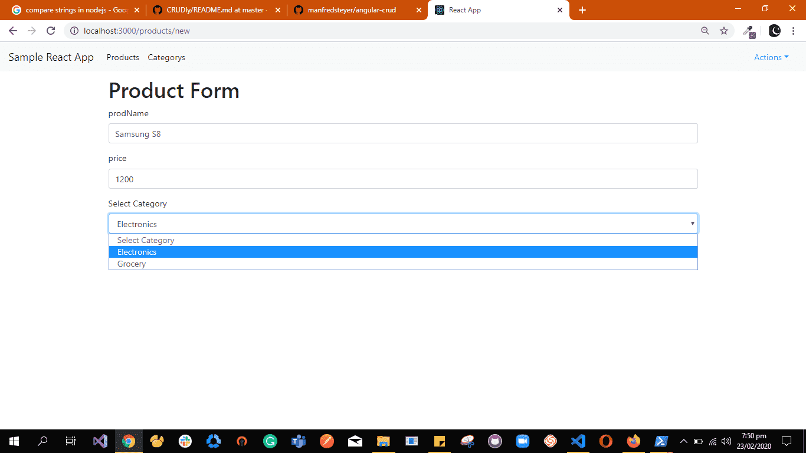
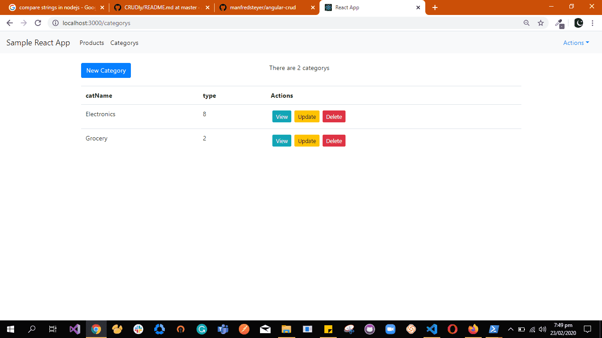

# MERN CRUD Generator

The project is a node application that takes json schema as input and generate a MERN CRUD Application as output.The purpose of creating the project is
1. To save developers time generating all the four CRUD functionalities for each Entity.
2. Generate relations between these entities if there are any. 
3. To provide React, Node and Express developers with an easy to read and update code following good conventions. 

## What Projects can be generated?

1. User can generate a complete MERN CRUD application.This option generate two projects. 
   - **React Project** which contains create, update Forms and a List page having View and delete functionality for each entity. The Project also constains login, signUp and update user information form. check out [React Project Features](https://github.com/UmairAwan128/MERN-CRUD-Generator#react-project-features) for details.
   - **Node project** which contains the database models,Express API endpoints for each entity and also creates the database in MongoDB check out [Node Project Features](https://github.com/UmairAwan128/MERN-CRUD-Generator#node-project-features) for details.
2. User can generate only the Node/Express api CRUD, In this case only node project is generated.  
   - **Node project** which contains the database models,Express API endpoints for each entity and also creates the database in MongoDB check out [Node Project Features](https://github.com/UmairAwan128/MERN-CRUD-Generator#node-project-features) for details.
3. User can generate an empty MERN Application,This option don,t require schema from user and generate two projects. 
   - **React Project** haiving an empty Component along with login, signUp and update user information form.
   - **Node project** which in this case contains only "User" database model and its Express API endpoints and a database in MongoDB.

## Creating Schema for CRUD Generator input
   To successfully generate a MERN CRUD Application the only thing you need is to create a JSON file having the following set of properties. Every thing you need to know about these properties is defined in following table.

| property name   | type      | info                                                                             |            | default value  
| --------------- | --------- | -------------------------------------------------------------------------------- | ---------- | ------------- |
|**appName**      |**string** | Its value will be used as the name of application generated.                     | optional   | `sampleApp`   |
|**appTheme**     | **enum**  | Its value  is used to decide the theme of the generated React application.       | optional   | `defaultLight`|
|                 |           | Its value can be `dark`, `defaultLight`, `electricBlue`.                         |            |               |
|**appDbName**    |**string** | Its value will be used as the name of the database created for generated project.| optional   | `sampleDB`    |
|                 |           | If its not passed but `appName` is passed then DB name will also be its value.   |            |               |
|**appSchema**    |**object** | It has two arrays representing the app to generate `tables`,`relations`.         | required   |               |
| **tables**      | **array** | It contains a collection of objects each representing an entity.                 | required   |               |
|                 |           | Each contains two properties `name` and `columns` representing its structure.    |            |               |
|  **name**       |**string** | Its value will be the name of the entity but there is a restrication that,       | required   |               |
|                 |           | the first letter of the string should be capital.                                |            |               |
|  **columns**    |**array**  | It contains a collection of objects each representing a property of an entity.   | required   |               |
|                 |           | It has three properties `name`, `type` and `required`.                           |            |               |
|   **name**      |**string** | It is the name property of columns array the first one was name for the entity.  | required   |               |
|                 |           | Its value will be used as name of the specific property of entity.               |            |               |
|   **type**      | **enum**  | Its value will be used as the type of the specific property of entity.           | required   |               |
|                 |           | Its value can be either `text`,`number`,`email`,`password`,`date`.               |            |               |
|   **required**  |**boolean**| Its value will be used to tell either the specific property of entity is required| optional   | `false`       |
|                 |           | Its value can be either `true`,`false`.                                          |            |               |
| **relations**   |**array**  | It contains a collection of objects each representing a relation b/w two entities| optional   |               |
|                 |           | It has four properties,                                                          |            |               |
|                 |           | `firstTable`, `secondTable`, `relationType`, `secondTableColumn`.                |            |               |
|**firstTable**   |**string** | Its value should be same as `name` of any entity we defined in `tables` property | required   |               |
|**secondTable**  |**string** | Its value should be same as `name` of any entity we defined in `tables` property | required   |               |
|                 |           | so the relation will be created b/w `firstTable` and `secondTable`.              |            |               |
|**relationType** | **enum**  | Its value will be used to tell the type of the relation b/w the two entities,    | required   |               |
|                 |           | we defined  in `firstTable` and `secondTable`. Its value can be either           |            |               |
|                 |           | `select`, `radio`, `checkBox`,`multiselect`,`oneToMany`,`manyToMany`.            |            |               |
|                 |           | for details regarding each type checkout [Realtions Supported](https://github.com/UmairAwan128/relations-between-entities).            |            |               |
|secondTableColumn|**string** | Its value should be same as `name` property value from `columns` array of the    | required   |               |
|                 |           | respective entity mentioned in `secondTable`, [Where its used?](https://github.com/UmairAwan128/relations-between-entities).  |            |               |

## Relations Between Entities
A realtion b/w two entities is created using 4 properties `firstTable`, `secondTable`, `relationType`, `secondTableColumn`, to understand how a relation is created lets take an example say we have two entities `product` and `category` and we want to create a relation of type `select` 
between them.
 - The `product` has two properties `prodName` and `price`.
 - The `category` has two properties `catName` and `type`.
If a relation object has these values `firstTable`="product", `secondTable`="category", `relationType`="select", `secondTableColumn`="catName".
This means in the `product` create form there will be a `category` select/dropdown and that dropdown will have the data of the `catName` property of the `category` entity.

   

      
   

   

      
   

   

Currently CRUD Generator supports the following relation types.

| relationType    |  info                                                                               |
| --------------- | ----------------------------------------------------------------------------------- |
| **select**      | creates a select/dropdown representing a one to many relation b/w the entities      |
| **radio**       | creates a radio buttons representing a one to many relation b/w the entities        |
| **checkBox**    | creates checkboxes representing a many to many relation b/w the entities            |
| **multiselect** | creates a multiSelect/dropdown representing a many to many relation b/w the entities|
| **oneToMany**   | creates a select/dropdown representing                                              |
| **manyToMany**  | creates a multiSelect/dropdown representing                                         | 

## React Project Features

-   For each entity seperate React Components are created for Create,View,Update,delete and list page.
-   For each entity seperate **service** is created for get, put, post and delete calls to the Node Project the
    services uses [axios](https://www.npmjs.com/package/axios) for this purpose.
-   Each Form element/input will have **client side validation** applied using [JOI](https://www.npmjs.com/package/joi) depending upon type of the element that user provides.
-   List Page avoid lengthy pages by providing **pagination**. 
-   Provides **Authentication System** containing 5 functionalties 
    login, logout, register, update password and user inforamtion using their forms.
-   The Navbar will have the name of all the Entities user provided for easy **navigation** b/w all these CRUD's. 
    We used [react-router-dom](https://www.npmjs.com/package/react-router-dom) for ease.
-   Depending upon the name of **theme** provided the UI of the App changes.
-   Responsive Design for both Desktop and mobile size displays.

## Node Project Features

-   For each entity seperate **database models** are created using [Mongoose](https://www.npmjs.com/package/mongoose).
-   For each entity seperate **API Endpoints** are created i.e all [get, put, post and delete] which are accessible
    by authenticated users of generated React Project. These endpoints are created using [express](https://www.npmjs.com/package/express). 
-   For Providing **Authentication System** a User database model and its respective API Endpoints are automatically
    created. The project uses [jsonwebtoken](https://www.npmjs.com/package/jsonwebtoken) for token managment.
-   The project creates respective **database** in MongoDB with a default user which can login.
-   The project also has [nodemon](https://www.npmjs.com/package/nodemon) which helps developers by automatically  
    restarting the application when file changes are detected.

## Sample Scheema File
